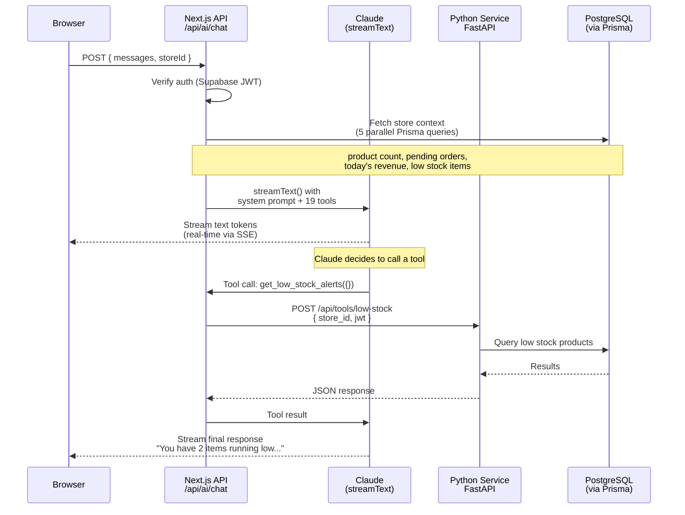
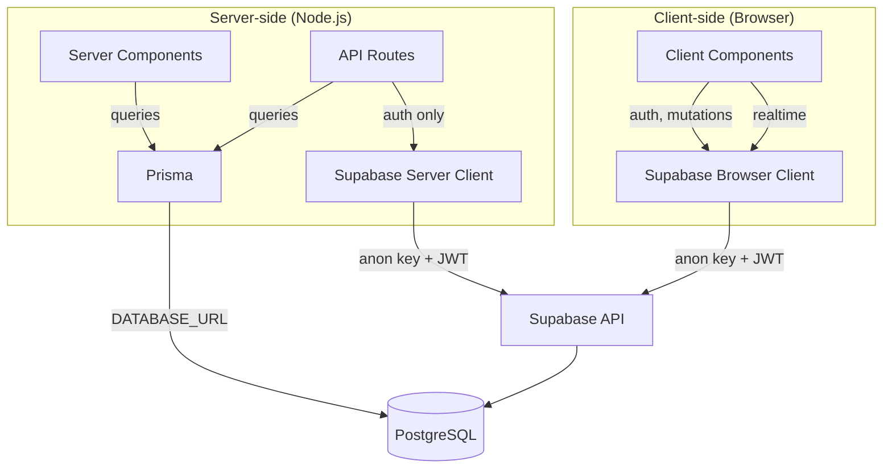

# Stoca Architecture

## Overview

Stoca is an AI-native local commerce platform. Store owners manage their business through a dashboard with an embedded AI chat assistant that can update prices, manage inventory, process orders, and scan shelf photos — all via conversation with tool-calling.

The architecture splits into three layers:
1. **Next.js 16** — frontend, AI orchestration (calls Claude directly), auth handling
2. **Prisma 7** — type-safe PostgreSQL access for all data queries
3. **Python/FastAPI** — tool execution backend (vision, search, CRUD operations)

## Streaming Chat Flow

This is the core of the product — how a user message becomes an AI response with tool execution:



**Key detail**: `maxSteps` is set to 10 via `stopWhen: stepCountIs(10)`, allowing Claude to chain multiple tool calls in a single turn (e.g., "check low stock, then update the prices of those items").

## Auth Flow

```mermaid
flowchart LR
    A[Browser] -->|signIn/signUp| B[Supabase Auth]
    B -->|JWT in cookies| C[Next.js Middleware]
    C -->|Refresh session| D{Protected route?}
    D -->|No| E[Render page]
    D -->|Yes, no session| F[Redirect /login]
    D -->|Yes, has session| E
    
    E -->|API call| G[API Route]
    G -->|getUser()| B
    G -->|Forward JWT| H[Python Service]
    H -->|Validate JWT| B
```

**Authentication layers**:

| Layer | What happens |
|---|---|
| **Middleware** (`middleware.ts`) | Refreshes Supabase session cookies on every request. Redirects unauthenticated users from protected paths (`/dashboard`, `/orders`, `/onboarding`, `/cart`, `/checkout`) to `/login`. |
| **Dashboard layout** (`dashboard/layout.tsx`) | Server-side guard — fetches user, verifies `STORE_OWNER` role, checks store exists. Redirects to `/`, `/login`, or `/onboarding` as needed. |
| **API routes** | Call `supabase.auth.getUser()` to verify JWT. Chat route also verifies store ownership via Prisma. |
| **Python service** | Validates the forwarded JWT against Supabase, resolves `store_id` from the token's `sub` claim. |

**Role assignment**: During `signUp`, the client passes `role` in `options.data`. The `handle_new_user()` PostgreSQL trigger reads `raw_user_meta_data.role` and only allows `CUSTOMER` or `STORE_OWNER` (blocks `ADMIN` from client).

## Data Access Patterns

Stoca uses **two database access paths** for different purposes:



| Access Path | When to use | RLS | Type Safety |
|---|---|---|---|
| **Prisma** | Server Components, API routes — all reads, complex queries | Bypassed (direct DB) | Full — generated types |
| **Supabase Browser Client** | Client components — auth, cart mutations, order RPC, Realtime | Enforced | Manual types |
| **Supabase Server Client** | API routes — auth verification only (`getUser`, `getSession`) | Enforced | Manual types |

**Why Prisma over raw Supabase client for queries?**
- **Type safety** — Prisma generates a typed client from the schema. `prisma.stores.findUnique({ where: { slug } })` catches typos at compile time; `supabase.from('stores').select('...')` doesn't.
- **Relations** — Prisma's `include` is cleaner than Supabase's embedded select syntax for joins.
- **No RLS complexity** — Server Components don't need RLS since they already verify ownership in application code. Prisma's direct connection avoids RLS policy debugging.

**Why keep Supabase client at all?**
- **Auth** — Supabase manages JWT issuance, refresh, and cookie handling. Prisma can't do auth.
- **Storage** — Image uploads go through Supabase Storage API.
- **Realtime** — Dashboard subscribes to order changes via Supabase Realtime channels.
- **Cart mutations** — Client-side cart operations (upsert, delete) use Supabase with RLS so users can only modify their own cart.

## Folder Structure

```
stoca/
├── app/
│   ├── (public)/                  # Landing, store/[slug], product/[id], search
│   │   └── layout.tsx             # Navbar + Footer, fetches user profile via Prisma
│   ├── (auth)/                    # Login, register
│   │   └── layout.tsx             # Centered card layout, no navbar
│   ├── (customer)/                # Cart, checkout/[storeId], orders
│   │   └── layout.tsx             # Navbar + Footer (same pattern as public)
│   ├── dashboard/                 # Store owner dashboard (/dashboard URL)
│   │   ├── layout.tsx             # Auth guard + sidebar shell
│   │   ├── page.tsx               # Order queue (65%) + AI chat (35%)
│   │   ├── DashboardContent.tsx   # Client component: Realtime, order actions
│   │   ├── DashboardContext.tsx    # Store context provider for child pages
│   │   ├── DashboardShell.tsx     # Sidebar nav + mobile hamburger
│   │   ├── orders/page.tsx        # Full orders table with status filters
│   │   └── products/page.tsx      # Product grid with stock indicators
│   ├── onboarding/                # 4-step wizard: basics → hours → products → launch
│   ├── api/ai/
│   │   ├── chat/route.ts          # Claude streamText + 19 tools → Python
│   │   └── image/route.ts         # Image upload → Supabase Storage → Python scan
│   ├── components/
│   │   ├── chat/                  # ChatWindow, ChatMessage, ToolCallCard (showpiece)
│   │   ├── commerce/              # ProductCard, StoreCard, CartDrawer
│   │   ├── ui/                    # Button, Input, Badge, Card, Modal, etc.
│   │   └── layout/                # Navbar, Footer
│   ├── lib/
│   │   ├── prisma.ts              # Singleton: PrismaClient + PrismaPg adapter
│   │   ├── supabase/client.ts     # Browser client (createBrowserClient)
│   │   ├── supabase/server.ts     # Server client (createServerClient + cookies)
│   │   ├── supabase/middleware.ts  # Session refresh for Next.js middleware
│   │   ├── posthog.tsx            # PostHogProvider + event tracking helpers
│   │   └── utils.ts               # cn(), formatPrice(), slugify(), etc.
│   └── types/                     # TS interfaces matching DB schema
├── prisma/
│   └── schema.prisma              # Prisma schema (introspected from Supabase)
├── prisma.config.ts               # Prisma 7 config (datasource URL)
├── supabase/
│   ├── migrations/001_initial.sql # Full schema: tables, RLS, triggers, RPC
│   └── seed.sql                   # Demo data: 5 users, 2 stores, 41 products
└── middleware.ts                   # Supabase session refresh + route protection
```

## Key Design Decisions

### Dashboard as `/dashboard` (not a route group)

The dashboard uses a real path segment (`app/dashboard/`) instead of a route group (`app/(dashboard)/`). **Why**: Route groups don't add URL segments, so `(dashboard)/page.tsx` would resolve to `/` — conflicting with `(public)/page.tsx`. Similarly, `(dashboard)/orders/` would conflict with `(customer)/orders/`. Using `dashboard/` as a real path avoids all conflicts.

### Next.js calls Claude directly

The chat API route calls `streamText()` directly from `@ai-sdk/anthropic`, rather than routing through the Python service. **Why**: Lower latency (one fewer network hop for the streaming connection), simpler architecture (tool definitions live next to the route handler), and the Python service doesn't need to manage streaming connections.

### Python for tool execution only

Tool handlers in the chat route don't execute database operations directly — they forward to the Python service. **Why**: Separates AI orchestration from business logic. Tools can be tested independently via HTTP. The Python service also handles operations that need Claude Vision (inventory scanning) and embeddings (semantic search), which are better suited to Python's ecosystem.

### `create_order_from_cart()` as a PostgreSQL RPC

Orders are never created via direct INSERT. The `create_order_from_cart()` function runs as a single transaction that: validates the cart, calculates totals, creates the order + items, decrements stock, and clears the cart. **Why**: Atomicity — no partial orders if stock runs out mid-checkout. The function uses `SECURITY DEFINER` and `auth.uid()` so it works through the Supabase client without needing the service role key.

### Supabase Realtime for live order updates

The dashboard subscribes to the `orders` table filtered by `store_id`. When a customer places an order, the dashboard receives it instantly and shows a toast notification. **Why**: No polling, sub-second latency, and Supabase handles the WebSocket infrastructure.

### Prisma Decimal fields require `Number()` conversion

Prisma returns `Decimal` objects (not plain numbers) for `NUMERIC` columns. All server components that pass prices/totals to client components must call `Number(field)`. This is a Prisma 7 behavior — the adapter returns exact decimal types to prevent floating-point precision loss.

## Next.js ↔ Python Tool Wiring

The AI chat route (`app/api/ai/chat/route.ts`) defines 19 tools for Claude and delegates execution to the Python service via `callToolService()`. This section covers the integration details that are not obvious from reading either side in isolation.

### Auth forwarding

Next.js extracts the Supabase JWT from the user's session and forwards it in the `Authorization` header on every tool call. The Python middleware validates the JWT against Supabase and resolves the `store_id` from the owner's profile row — the Next.js side never sends `store_id` in the request body. This means the Python service is the single authority on store ownership: even if a malicious client somehow tampers with the request, the store context comes from the verified JWT, not from user-supplied parameters.

```
Next.js: session.access_token → Authorization: Bearer <jwt>
Python:  jwt.sub → profiles.id → stores.owner_id → store_id
```

### Parameter conventions

Tools follow consistent naming conventions for how they identify resources:

| Pattern | Parameter | Python behavior | Example tools |
|---|---|---|---|
| **By name** | `product_name` | ILIKE fuzzy match against `store_products.name` | `update_product_price`, `remove_product`, `update_stock_quantity` |
| **By UUID** | `product_id`, `order_id` | Exact match on primary key | `get_order_details`, `update_order_status` |
| **By search query** | `query` | Semantic or text search | `search_store_products`, `add_product_from_catalog` |

The catalog search tool (`add_product_from_catalog`) accepts a `query` string for fuzzy matching against the global catalog — it does not use `global_product_id`. This lets Claude add products by name ("add Coca-Cola at $2.50") without needing to look up IDs first.

### Enrichment tools

Three tools handle product data quality, making for impressive demo moments where the AI autonomously improves product listings:

| Tool | What it does | Backend detail |
|---|---|---|
| `search_product_image` | Finds a product photo via the Pexels API and sets it as the product image | Falls back to a placeholder image if Pexels returns no results |
| `enrich_product_description` | Generates a compelling product description | Uses Claude via the Python enrichment service (one of the few places Python calls Claude directly) |
| `enrich_products_bulk` | Enriches multiple products at once — images, descriptions, or both | Caps at 20 products per call to avoid timeouts; accepts a `filter` param (`missing_images`, `missing_descriptions`, `all`) |

These tools are particularly useful in a demo flow: the store owner asks "make my products look better" and the AI chains `enrich_products_bulk` to fill in missing images and descriptions across the entire catalog in one turn.

### Error handling

`callToolService()` catches all errors — both HTTP failures and network errors — and returns human-readable strings rather than throwing exceptions. This design is intentional: Claude receives the error as a tool result and can relay it conversationally ("I wasn't able to update that price — the product wasn't found") instead of the chat breaking with an unhandled exception.

```typescript
// On HTTP error:  "Error: 404 - Product 'xyz' not found in your store"
// On network failure: "Error: Failed to reach AI service - ECONNREFUSED"
```

Both cases produce a string that Claude can interpret and explain to the store owner. The chat never crashes from a failed tool call.
